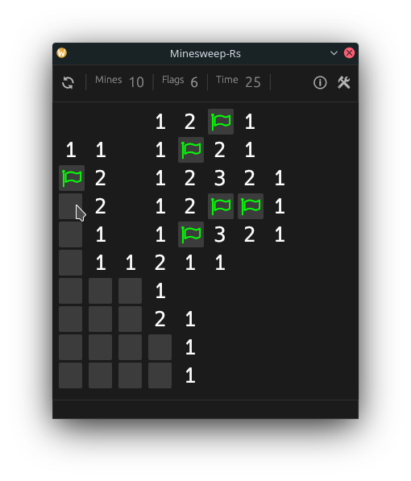

# minesweep-rs

A rust implementation of the popular game, using the [egui](https://github.com/emilk/egui) library.

## Screenshot


## Build & run

### Desktop

```bash
git clone https://github.com/BogdanOlar/minesweep-rs.git
cd minesweep-rs/
cargo run --release
```

### Wasm

In progress ...

## TODO

- [X] Linux
- [ ] WASM

- [ ] `egui` layout
- [ ] Config

## License

- MIT license ([LICENSE-MIT](LICENSE))
